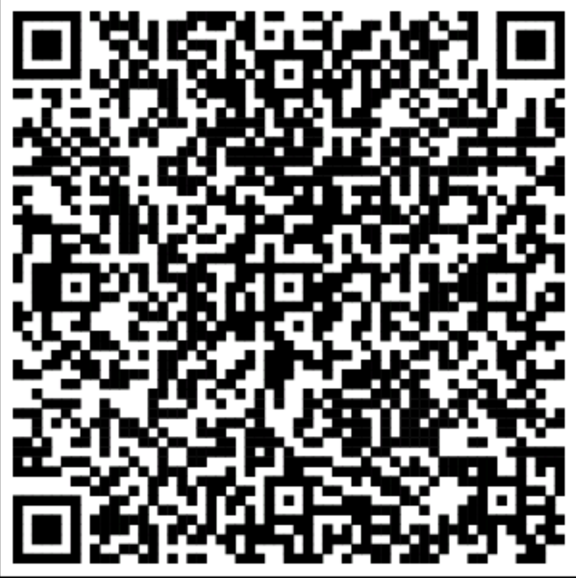
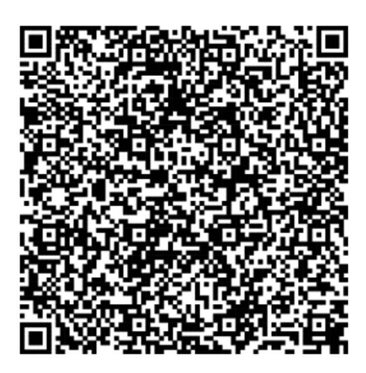
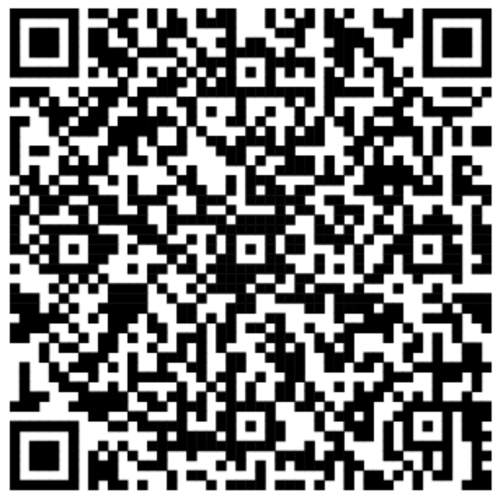
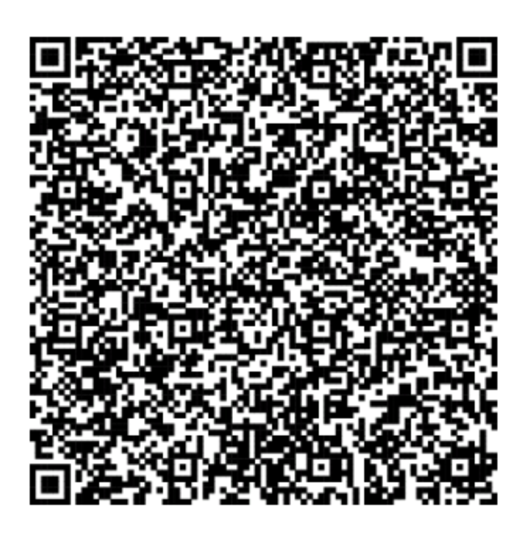
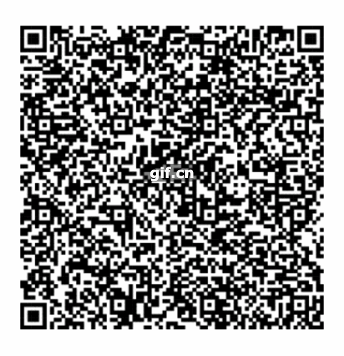

# Cobo Vault Integration Guide
Cobo Vault is an air-gapped, QR Code based hardware wallet. it would like to be the pure signer for your crypto transaction, Cobo Vault don't have other connections like BlueTooth, WIFI, etc. the only way it can transmit data is via QR codes.
this guide is for developer who would like to integrate their services with Cobo Vault.

### Animated QR Codes
In Cobo Vault, we use QR Codes to transmit data, since each qr code image can only contain limit size of data. in order to send big chunk of data, we use animated QR codes to transmit big chunk of data. we are using the bc-ur to encode the data, for bc-ur please refer this [doc](https://github.com/CoboVault/Research/blob/master/papers/bcr-0005-ur.md)
we have implemented two libraries of bc-ur:
- javascript version: https://github.com/CoboVault/cobo-vault-blockchain-base/tree/master/packages/sdk
```
// here is an sample:
yarn add @cvbb/sdk
const { CoboVaultSDK } = require("@cvbb/sdk")
const sdk = new CoboVaultSDK()
const data = sdk.encodeDataForQR('12334')
console.log(data)
// [ 'ur:bytes/1248938493496dfhjdh34' ]
```
each item in the array should be put into the qr code image.

- java version: https://github.com/CoboVault/bc32-java

#### libraries
##### web
there are a lot of existing libraries which currently can be used to scan qr codes and here is some of it used by our friends :)
- [qr-scaner](https://github.com/nimiq/qr-scanner)
- [vue-qr-code](https://github.com/gruhn/vue-qrcode-reader/) 

##### React Native
 - [react-native-camera](https://github.com/react-native-camera/react-native-camera)
 
##### Native App
for IOS and Android App we can use their native libraries to scan QR Codes.
  
## BTC Only Firmware
we provide BTC-only Firmware for Bitcoiner. you can get the latest firmware from [here](https://cobo.com/hardware-wallet/downloads), For Bitcoin, we follow the BIP174, aka PSBT to encode transaction. for ones who is not familiar with BIP174 and PSBT here are some good reference guides.

- https://github.com/bitcoin/bips/blob/master/bip-0174.mediawiki
- https://bitcointechweekly.com/front/bip-174-psbt-partially-signed-bitcoin-transactions/
- https://en.bitcoin.it/wiki/BIP_0174

And we strictly follow the [slip-0132](https://github.com/satoshilabs/slips/blob/master/slip-0132.md) to encode the extended public key.
Coin                                      | Public Key            | Address Encoding                | BIP 32 Path |
------------------------------------------|-----------------------|---------------------------------|-------------|
[Bitcoin](https://bitcoin.org/)           | `0x0488b21e` - `xpub` |P2PKH or P2SH                    | m/44'/0'    |
Bitcoin                                   | `0x049d7cb2` - `ypub` |P2WPKH in P2SH                   | m/49'/0'    |
Bitcoin                                   | `0x04b24746` - `zpub` |P2WPKH                           | m/84'/0'    |
Bitcoin                                   | `0x0295b43f` - `Ypub` |Multi-signature P2WSH in P2SH    | m/48'/0'/0'/1'           |
Bitcoin                                   | `0x02aa7ed3` - `Zpub` |Multi-signature P2WSH            | m/48'/0'/0'/2'           |
Bitcoin Testnet                           | `0x043587cf` - `tpub` |P2PKH or P2SH                    | m/44'/1'    |
Bitcoin Testnet                           | `0x044a5262` - `upub` |P2WPKH in P2SH                   | m/49'/1'    |
Bitcoin Testnet                           | `0x045f1cf6` - `vpub` |P2WPKH                           | m/84'/1'    |
Bitcoin Testnet                           | `0x024289ef` - `Upub` |Multi-signature P2WSH in P2SH    | m/48'/1'/0'/1'           |
Bitcoin Testnet                           | `0x02575483` - `Vpub` |Multi-signature P2WSH            | m/48'/1'/0'/2'           |


### Single-Sig
currently we have integrated with a lot of well-known wallet, like electrum, BlueWallet, Wasabi Wallet, BTCPay, Spector etc. and also we provide and generic wallet model to other wallets or services who would like to integrate with us. 

#### Setup the watch-only wallet

watch-only wallet import the extended public key info from cobo vault, cobo vault support both file and qrcode, the xpub info defines as follow, here is an sample file for this info:

- `ExPubKey [Required]`:  this is the extended public key of the master seed
- `MasterFingerprint [Required]`: this is the master finger print of master seed which is only used to identify the master seed
- `AccountKeyPath [Required]`: this is the derivation path of the extended public key
- `CoboVaultFirmwareVersion [Required]`: this is the firmware version in current hardware device. 

file: `p2wpkh-pubkey.txt`
```
{
    "ExtPubKey":"vpub5Z3SXQwuvQWt5vBQiRYrqhbou6BB7u1TFcA4DTQxPirU4oqMwnWW5DcSmM31h7SzofmUM3xHHn8rEht38jyuX8tfXS2D1desPVRsvnD5Dtr",
    "MasterFingerprint":"5271C071",
    "AccountKeyPath":"84'/1'/0'",
    "CoboVaultFirmwareVersion":"1.8.2(BTC-Only)"
}
```

QR Code (json string):



#### Sign PSBT
we use psbt to encode the unsinged transaction and we provide two ways for that:
1. File:The unsigned PSBT file should be encoded as binary or base64 encoding and should use the .psbt file extension. reference [bip174](https://github.com/bitcoin/bips/blob/master/bip-0174.mediawiki) here is the example unsigned psbt file [example](./unsigned_single_sig_psbt.psbt)

2. QRCode: we use bc-ur to encode the psbt data. and here is an sample QRCode Image. 


#### export Signed PSBT

after signing, user can export the signed psbt, we provide two ways for that:

1. signed psbt file: see the example signed psbt file [example](./signed_41262fb9.psbt)

2. QRCode: here is the sample qr code of signed PSBT. 



## Multi-Sig
we also support Multi-Sig for Bitcoin, currently we can use Cobo Vault and ColdCard to set up Multi-Sig Wallet and perform multi-Sig, we have integrated with Electurm, Spector-Desktop and you can check this guide about how to use Cobo Vault to perform multi-sig https://btcguide.github.io/

#### Setup Multi-sig wallet

Users can create a Multi-sig wallet by collect all co-signers extended public key or import a multi-sig wallet file export from another Cobo vault co-signer.

user can get the xpub by following this guide: https://btcguide.github.io/setup-wallets/cobo

1. export the xpub of co-signer, it can be export via file or QR Code：

    file: `5271C071_P2WSH.json` (export from cobo vault)
   ```
   {
    "xfp":"5271C071",
    "xpub":"Vpub5mpRVCzdkDTtCwH9LrfiiPonePjP4CZSakA4wynC4zVBVAooaykiCzjUniYbLpWxoRotGiXwoKGcHC5kSxiJGX1Ybjf2ioNommVmCJg7AV2",
    "path":"m/48'/1'/0'/2'"
   }
   ```
   
    - "xfp" is the master fingerprint
    - "xpub" is the extended public key
    - "path" is the derivation path of the extended public key

   
QR Code(json string):



2. Import Multi-sig wallet, Multi-sig wallet data format

these data can be export via fil or QR Code, here is a sample file:

    ```
    # CoboVault Multisig setup file (created on C2202A77)
    #
    Name: CV_85C39000_2-3
    Policy: 2 of 3
    Derivation: m/48'/1'/0'/2'
    Format: P2WSH

    C2202A77: Vpub5nbpJQxCxQu9Nv5Effa1F8gdQsijrgk7KrMkioLs5DoRwb7MCjC3t1P2y9mXbnBgu29yL8EYexZqzniFdX7Xo3q8TuwkVAqbQpgxfAfrRiW
    5271C071: Vpub5mpRVCzdkDTtCwH9LrfiiPonePjP4CZSakA4wynC4zVBVAooaykiCzjUniYbLpWxoRotGiXwoKGcHC5kSxiJGX1Ybjf2ioNommVmCJg7AV2
    748CC6AA: Vpub5mcrJpVp9X8ZKsjyxwNu36SLRAWTMbqUtbmtcapahAtqVa66JtXhT4Uc9SVLN1nF782sPRRT2jbUbe7XzT8eue6vXsyDJKBvexGJHewyPxQ
    ```

- Name: the multi-sig wallet name
- Policy: multi-sig policy like 2 of 2 , 2 of 3
- Derivation: the Derivation path of all the extend public key for multi-sig
- Format: your script format, current we support P2WSH, P2WSH-P2SH, P2SH (P2SH-P2MS)

the following items are master finger print and its extended public key
- {master fingerprint:extended public key}

the data format should be consistent with the file the all the field should be exist.

QrCode (bc-ur): 

we use bc-ur to encode this sample file and here is an sample data:

    ```
    UR:BYTES/TYQL2GEQGDHKYM6KV96KCAPQF46KCARFWD5KWGRNV4682UPQVE5KCEFQ9P3HYETPW3JKGGR0DCSR2V3HX9PNQDE39Y9ZXZJWV9KK2W3QGDT97WP4GVENJVPSXP0NYTFNPFGX7MRFVDUN5GPJYPHKVGPNPFZX2UNFWESHG6T0DCAZQMF0XSUZWTE3YUHNQFE0XGNS53N0WFKKZAP6YPGRY46NFQ9Q5SEJXGCRYSFHXUAZQ4NSW43R2MNZWP99Z7ZR0PGH2W2WWC652ENXVYC5VWR8V3GHX6T2WFNKKD6TWFXKK6T0F3EN23R02FMKYD6DGD4YXVM5X9GRY7FED4VXYMJZVA6NYWTEFSUY2KT90PD8Z7NWD9RXGKPHTPHNXUFC236HW66KG9CKY5TSVAUXVSTXWFFXJ4C2X5ERWV2RXQMNZW3Q2EC82C34D4C9Y4JR0FJXK3Z5W3PHWJPEF3EXV6TF2PHKUE2SDFGRGS662DSKKSF5WAUKUSE50FTYY4JPDAHKZ7TTD9PH56J4DE54JCJVWPTHSM6JDA6YW62CWAH5K3MRFPPN266N0P55536CX9VKY6NXXF5K7NN0D4K4VM2RFFNNWS2KXG9RWDPCGDPNVS2P8GS9VUR4VG6K6CMJFFC9VUPETQU95JMNDFUHSA6WW5ENV56V2FQ4W4ZDVFC42ARZD46XXCTSV95YZAR32ESNVDJ2W3VXS4P5243NJ56KF38RZMJXXUURYU6S2FF9GVN2VF2KYEFHTPA9GWR9W4JNVAJCWDU5GJJTGFMX27Z8FFYX2AME2PU9ZZSDGUVWA
    ```

and here is the sample image 




#### Sign PSBT

for multi-sig, unsigned and singed PSBT are consistent with single-sig and we also provide two ways for it.

unsigned psbt file:

see the example unsigned multisig psbt file [example](./unsigned_multisig_psbt.psbt)

unsigned psbt Qrcode(encoded in bc-ur):


#### Export Signed PSBT

signed multisig psbt file:

see the example partially signed multisig psbt file [example](./part_f6a35290_5271C071.psbt)

signed multisig psbt qrcode(encoded in bc-ur):



### FAQ

TODO
