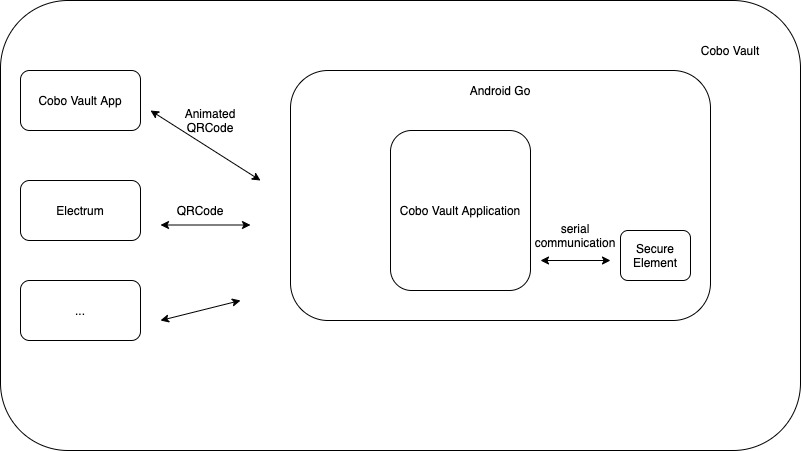

# Cobo Vault Developer Documents

Cobo Vault is an air-gapped, open source hardware wallet that uses completely transparent QR code data transmissions. Visit the Cobo Vault official [website](https://cobo.com/hardware-wallet/cobo-vault) to learn more.

## High Level Architecture
Cobo Vault is built on a specialized security hardware platform with a Secure Element that currently runs on a highly secure and enhanced Android Go platform.



The user’s master seed is saved in the Secure Element and never leaves it. The Secure Element communicates with the hardware wallet application layer through a serial communication protocol. Users need to set a password before using Cobo Vault, which can be used to unlock the device, sign transactions, or do other sensitive operations.

We use QR code data transmissions to air-gap. For details on the data protocol we use, please check [here](https://github.com/CoboVault/crypto-coin-message-protocol)

QR codes are limited in how data they can contain, so we use animated QR codes to handle larger transmissions of data. Here is an sample:

```
{
    "total": 2,
    "index": 1,
    "checkSum": "807271c36d6e275b0e89b023ccf8e3b6",
    "value": "H4sIAAAAAAAAAyVPu0oDURQ0UZYllWy51RKESGDdc88995VCJCaLjaIYbeW+tgoshAj+gxZ+gP6Dlb9h5f94F4eBmWaGmXxclJe966tH+7zdV3e7yz7E6nbX73vfb8uPcT4uLkghC+gUi2iRGx6EDjqQ4x2TTnsK1kt0gBC0AgHEQURhrTLo0QkTp7+jyeF6c1WcOB+pSx21IIM1yWhqG5mpSShuu4jSMCyPrxuiWSNh1gxssPr6/vl8PTstFm+jyRxe1sSApQQJF4WUWrfE2xZWJtISl1yvrW6VRl1kDAaUk38dMM0YlxpgfgDZ4jzPiqOH+9WmzNO8p8FNU3/6w1Rn0kuMUSC3iCATjSFhlGc8aM6iV9X7zR9wPHYkQAEAAA==",
    "compress": true,
    "valueType": "protobuf"
}
```

The `total` field is for the total number of animated QR codes and the `index` field is for the index number of the QR codes. The `value` field is for the chunk of data. The `compress` field is an indicator of whether the data is compressed (currently we use gzip + base64 to compress data). The `checkSum` field is the checksum of the whole data.

we are working an demo of the animated QRCodes. once finished we will open it on our Github.

## Integration Guide
[integration](https://github.com/CoboVault/cobo-vault-docs/blob/master/Integration_guide.md) check this file, if you would like to do integration with Cobo Vault.

## Hardware docs
[hardware](https://github.com/CoboVault/cobo-vault-docs/tree/master/hardware): check the `hardware` folders for our hardware documents. Currently our schematic and BOM files are open source.

## Application docs
[applications](https://github.com/CoboVault/cobo-vault-docs/tree/master/application): check the `application` folders to see our applications documents.

## Secure Element docs
[se](https://github.com/CoboVault/cobo-vault-docs/tree/master/se): check the `se` folders to see our secure element documents.

## Audit-report docs
[audit-report](https://github.com/CoboVault/cobo-vault-docs/tree/master/audit-report): check the `audit-report` folders for audit report documents.

## Don't Trust, Verify!
`Don't Trust Verify`. Check our documentation to learn about how you can verify our firmware.
- [Verify Application](./application/Cobo_Vault_Application_Update_Package_Verification.md)
- [Verify Secure Element](./se/Cobo_Vault_SE_Firmware_Update_Package_Verification.md)
